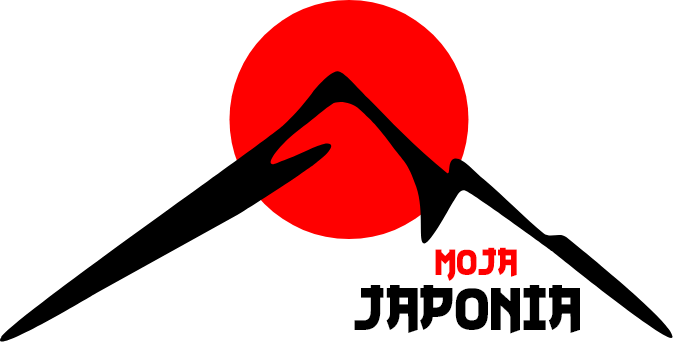

<p align="center">
  <a href="" rel="noopener">
 </a>
</p>

<h3 align="center">Moja Japonia</h3>

---

<p align="center"> Comprehensive guide for the country of the blooming cherry 
    <br> 
</p>

## 📝 Table of Contents

- [Getting Started](#getting_started)
- [Built Using](#built_using)
- [Authors](#authors)

## 🏁 Getting Started <a name = "getting_started"></a>

These instructions will get you a copy of the project up and running on your local machine for development and testing purposes.

### Prerequisites

What things you need to run the project.

- [NodeJs](https://nodejs.org/en/)
- [Npm](https://www.npmjs.com)
- [MongoDB](https://www.mongodb.com/)

### Installing

Using git clone repository

```
git clone https://github.com/mateuszbuturla/Japan-Tour.git
```

Go into the project folder

```
cd Japan-Tour
```

Install all dependencies for back-end

```
cd server && npm install
```

Install all dependencies for front-end

```
cd client && npm install
```

Run back-end

```
cd server && npm run start:dev
```

Run front-end

```
cd client && npm start
```

## ⛏️ Built Using <a name = "built_using"></a>

- [ReactJs](https://reactjs.org) - Web Framework
- [TypeScript](https://www.typescriptlang.org) - Extend JavaScript by adding types
- [Redux](https://redux.js.org) - Library for managing the state of the application
- [StyledComponents](https://styled-components.com) - Styling library
- [GSAP](https://greensock.com/gsap/) - Animation library
- [ReactHookForm](https://react-hook-form.com) - Forms
- [NodeJs](https://nodejs.org/en/) - Server Environment
- [NestJs](https://nestjs.com) - Server Framework
- [MongoDB](https://www.mongodb.com/) - Database

## ✍️ Authors <a name = "authors"></a>

- [@mateuszbuturla](https://github.com/mateuszbuturla) - Idea & Initial work
